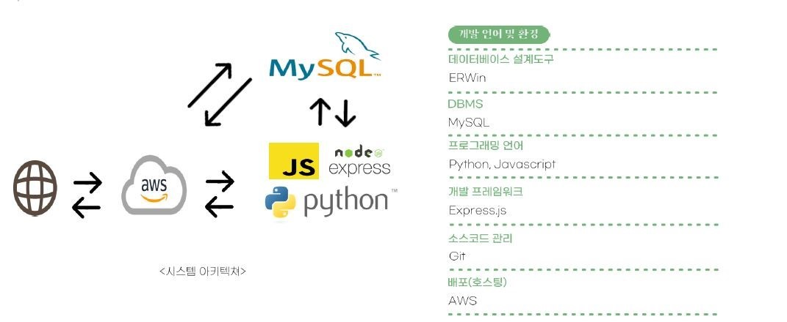
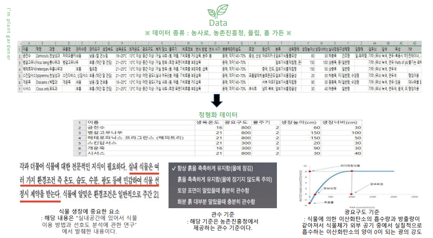
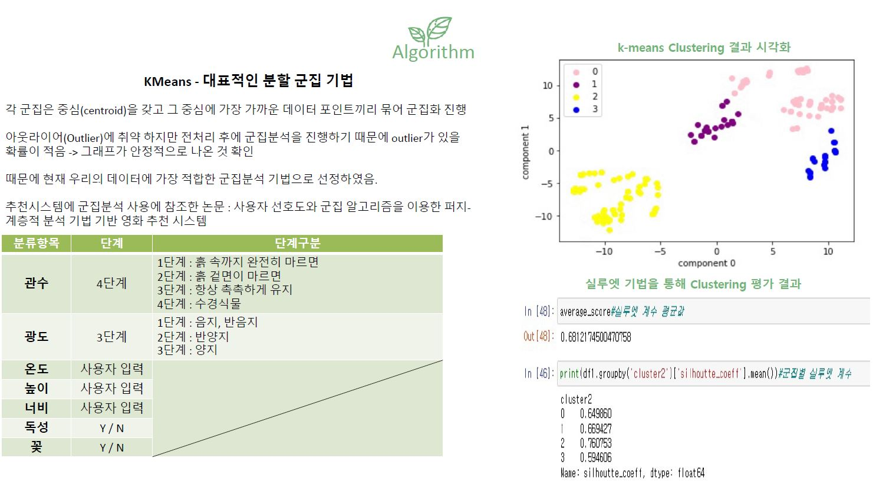
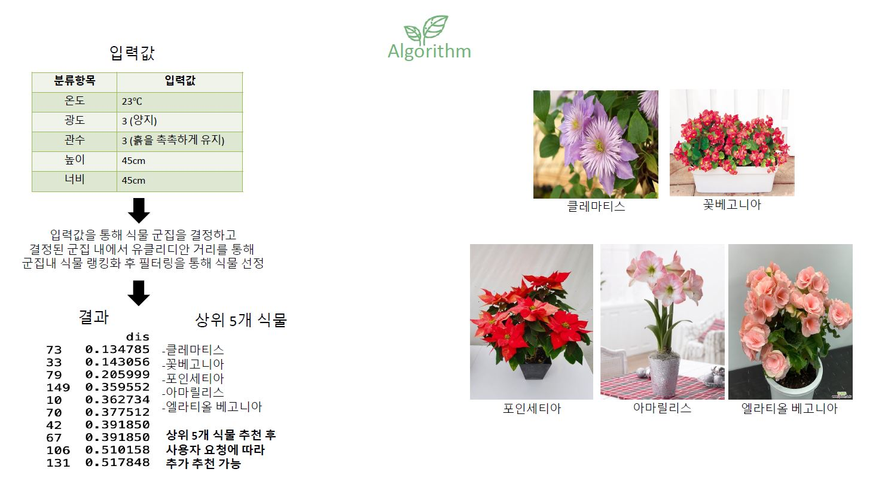
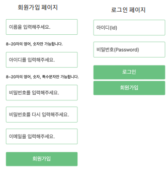
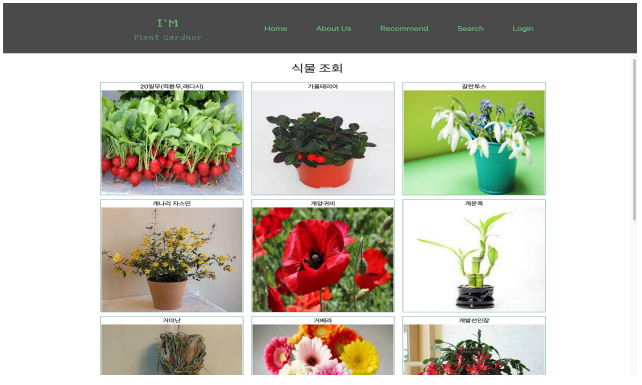
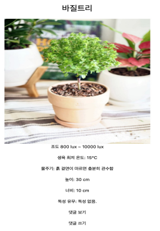
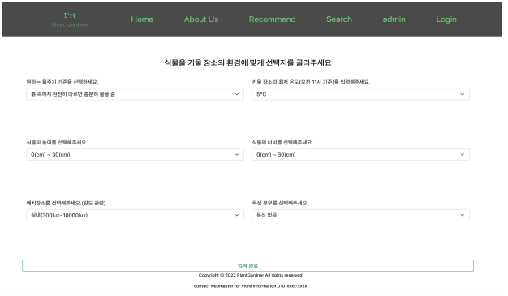
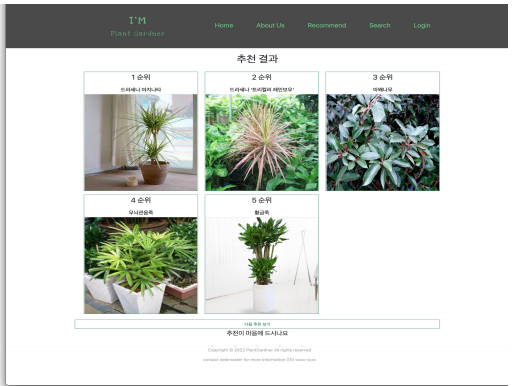
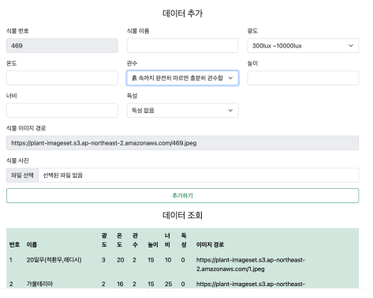

# Plant Gardner

   
  
   

## 프로젝트 소개

**반려 동물**을 키우시기에는 부담스러우신가요?  
이젠 **동물**이 아니라 한번 **식물**을 통해 힐링을 가져보세요! 
**동물**에 비해 상대적으로 손도 덜 가며 정서적인 안정감을 주는 **반려식물** 
저희 서비스는 사용자에 입력에 맞추어 사용자에게 알맞는 **식물**을 추천해드립니다 

 

## 팀원 소개

| 이름   | 역할 | 담당                                         |
| ------ | ---- | -------------------------------------------- |
| 오준호 | 팀장 | Backend 개발 + 배포환경 구축                 |
| 이일호 | 팀원 | Backend 개발 + 데이터 정제                   |
| 김선민 | 팀원 | Frontend 개발 + 데이터 학습 및 알고리즘 구축 |
| 김현중 | 팀원 | Frontend 개발 + 데이터 수집 & 정제           |

 

## 기술 스택

   
  
   

 

## Data

   
  
   

## 알고리즘

<figure class="half">
    
    
<figure>

## 실제 화면

### Main

   
  
   

### 회원가입 및 로그인

 

 

### 검색 및 조회

 

 

### 사용자 입력 및 식물 추천 결과

 

 

### 관리자 모드

 

 

 

 
